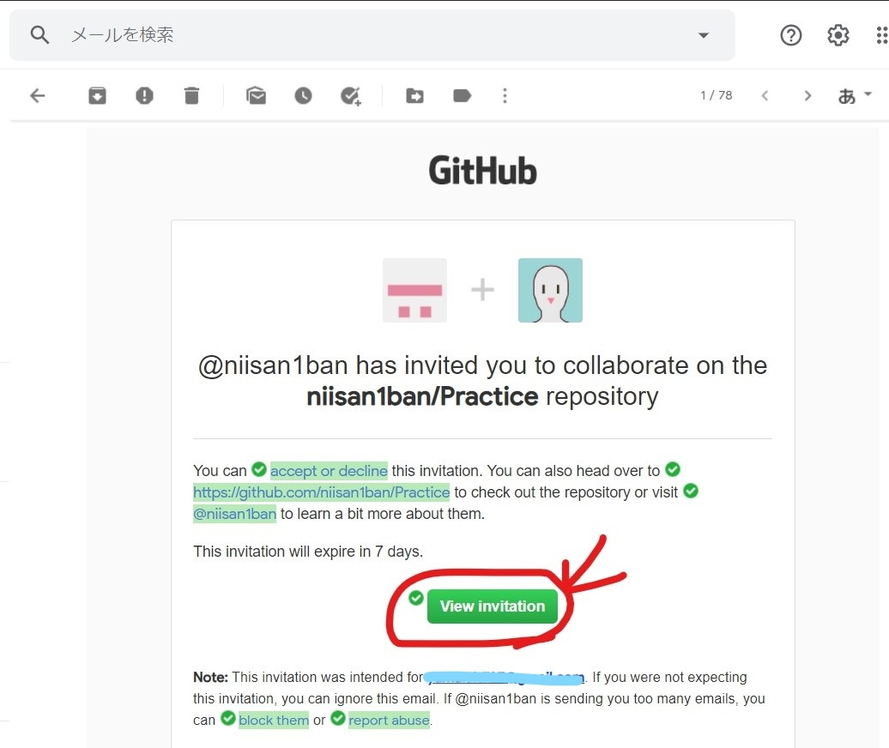

### A:GitHub上にリモートリポジトリを用意する

1. ブラウザで[GitHub](https://github.com/)にアクセスし、右上の+マークを押して「New repository」を選択する。


2. Repository name（リポジトリ名）を入力する。今回は「Practice」にした。必要ならばDescription（説明文）も入力する。その下のラジオボタンはPublicを選択し、Create repositoryをクリックする。

|選択肢|内容
|--|--
|Public|誰もが閲覧可能な公開リポジトリを作成する
|Private|許可した人しか見られない非公開リポジトリを作成する


3. Git Bashを起動し、任意の場所にPracticeディレクトリを作成し移動する。git initでローカルリポジトリを作成し、git remote addでリモートリポジトリの設定を行う。リモートリポジトリのURLは、Codeタブ内のQuick setupで確認できる。

```
$ mkdir Practice
$ cd Practice
$ git init
$ git remote add origin <リモートリポジトリのURL>
```


4. Practiceディレクトリ内でindex.htmlを作成し、以下の内容で保存した。


5. git addコマンドでindex.htmlをコミット対象に設定する。その後、git commitコマンドでコミットする。このとき、-mオプションでコミットメッセージが設定できる。

```
$ git add index.html
$ git commit -m "create index.html"
```

6. git pushコマンドでプッシュを行う。

```
$ git push origin master 
```


7. リモートリポジトリにindex.htmlが存在することを確認する。


### A:Bをコラボレーターとして招待する

1. Settingタブに切り替え、左側のメニューからManage accessをクリックする。次にInvite a collaboraterをクリックする。


2. 招待したい人(B)のユーザー名を入力すると、該当するユーザーが表示されるのでクリックする。その後、緑色のボタンをクリックする。


3.招待したユーザー(B)にメールが届くので、正体を受けてもらうと正式にコラボレーターになる。




### A:Bのプルリクエストをマージする

1. プルリク～～～